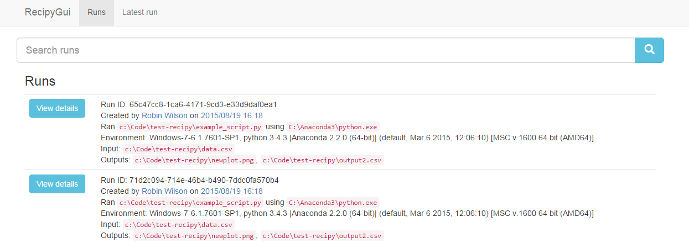

#Provenance

##Recipy

[Recipy](https://github.com/recipy/recipy) is a Python model for recording provenance automatically.

> Recipy: What is it and who cares?
> 
> Imagine the situation: You’ve written some wonderful Python code which produces a beautiful graph as an output. You save that graph, naturally enough, as graph.png. You run the code a couple of times, each time making minor modifications. You come back to it the next week/month/year. Do you know how you created that graph? What input data? What version of your code? If you’re anything like me then the answer will often, frustratingly, be “no”. Of course, you then waste lots of time trying to work out how you created it, or even give up and never use it in that journal paper that will win you a Nobel Prize.
> 
> This talk will introduce ReciPy (from recipe and python), a Python module that will save you from this situation! (Although it can’t guarantee that your resulting paper will win a Nobel Prize!) With the addition of a single line of code to the top of your Python files, ReciPy will log each run of your code to a database, keeping track of the input files, output files and the version of your code, and then let you query this database to find out how you actually did create graph.png.
>
>(from https://github.com/recipy/recipy)

##Prov

[PROV](http://www.w3.org/TR/prov-overview/) is a standard for recording provenance information.

> Provenance is information about entities, activities, and people involved in producing a piece of data or thing, which can be used to form assessments about its quality, reliability or trustworthiness.
> 
> The PROV Family of Documents defines a model, corresponding serializations and other supporting definitions to enable the inter-operable interchange of provenance information in heterogeneous environments such as the Web.
> 
> from (https://www.w3.org/TR/prov-overview/)

