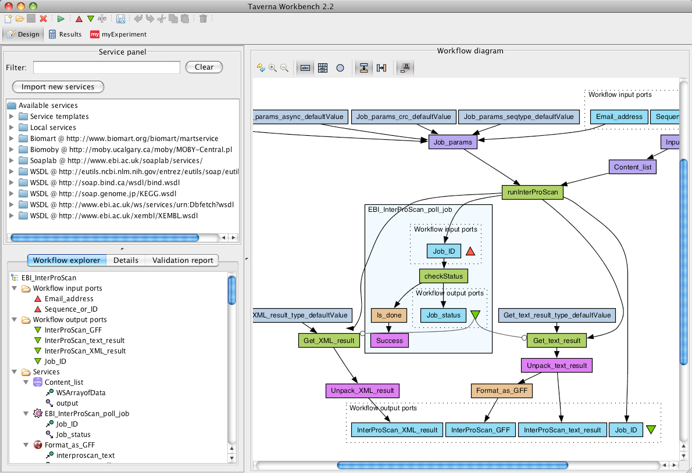

# Workflow Management Systems

Workflow Management systems(WFMS) are systems meant as a one-stop-shop for running workflows. These usually include a Graphical User Interface (sometimes called a workbench), an Engine for running workflows, etc.

## Apache Taverna

Taverna is an open source WFMS

> Taverna is an open source domain independent Workflow Management System - a suite of tools used to design and execute scientific workflows. Taverna was started by the myGrid project.
> The Taverna suite is written in Java and includes the Taverna Engine (used for enacting workflows) that powers both Taverna Workbench] (the desktop client application) and Taverna Server (which executes remote workflows). Taverna is also available as a Command Line Tool for faster execution of workflows from a terminal without the overhead of a GUI. Taverna automates experimental methods through the use of a number of different (local or remote) services from a diverse set of domains – biology, chemistry and medicine to music, meteorology and social sciences.
>
>Effectively, Taverna enables a scientist who has a limited background in computing, limited technical resources and support, to construct highly complex analyses over data and computational resources that are both public and private, all from a standard PC, UNIX box or Apple computer.

